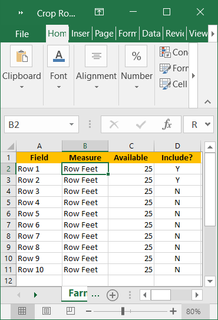
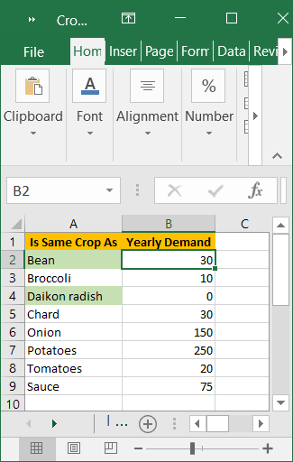
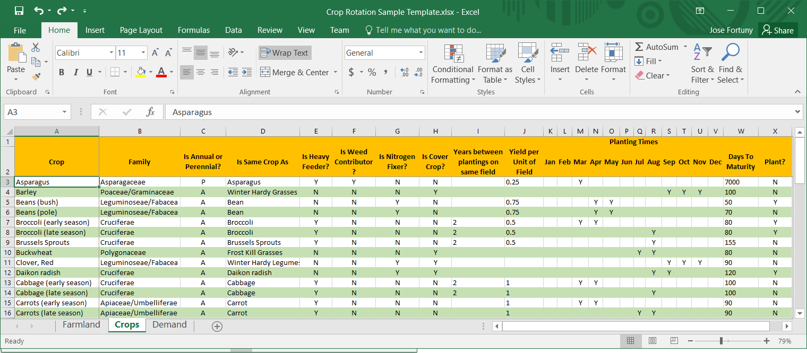

```{r setup, include=FALSE}
knitr::opts_chunk$set(echo = TRUE)
```

# Synopsis

The Crop Rotation model attempts to allocate crops to fields such that the consumption needs of the
user are satisfied while adhering to a set of constraints, described below.


## Elements of the model

There are some basic components of the model that are required for the model to exist. These are:

* A **Farm**, which is a collection of Fields
* **Fields** in the farm. A field is defined, in this model,
as the unit of land that will be planted, as a whole, with a single
crop. Thus it is the minimal, indivisible, planting unit.
The fields can be used in the determination of the rotation or can be set aside. 
The fields have a _measure_, which is under user control and there is an amount of that _measure_ in 
each field. In a vegetable crop setting, the measure will likely be _length_ of row (feet or meters of beds or rows, 
depending on setup); in a farm crop setting, the measure will likely be _surface_ of each field (acres or hectares in each field).


## Importing Farm Data

The model accepts its data from an Excel spreadsheet with tab names that identify the elements of the model 
and tab columns that identify the attributes of the element. Both tab names and column structure must adhere
to the standard format that follows. Three tabs are required in the model:

* Farmland
* Demand
* Crops

The spreadsheet must have at least three tabs named with the labels listed; without them the data import will fail.

### Farmland

The **Farmland** tab identifies the **Fields** in the **Farm** by name, their _Measure_ and how much land is _Available_, and whether or not they should be _Included_ in the rotation (acceptable values are Y or N).
The contents of the **Farmland** tab looks like this:

\ 


### Demand

The **Demand** tab identifies the Crop using a measure called **Is Same Crop As** (described under the Crop tab)
and the amount of the crop required for a year or **Yearly Demand**. The unit of measure of the **Yearly Demand**
is determined by the user and it requires consistency with the measure of yield in the Crop and by reference to the
**Field** . The contents of the **Demand** Tab looks like follows:

\ 


### Crops


\ 


## R Markdown

This is an R Markdown document. Markdown is a simple formatting syntax for authoring HTML, PDF, and MS Word documents. For more details on using R Markdown see <http://rmarkdown.rstudio.com>.

When you click the **Knit** button a document will be generated that includes both content as well as the output of any embedded R code chunks within the document. You can embed an R code chunk like this:

```{r cars}
summary(cars)
```

## Including Plots

You can also embed plots, for example:

```{r pressure, echo=FALSE}
plot(pressure)
```

Note that the `echo = FALSE` parameter was added to the code chunk to prevent printing of the R code that generated the plot.
