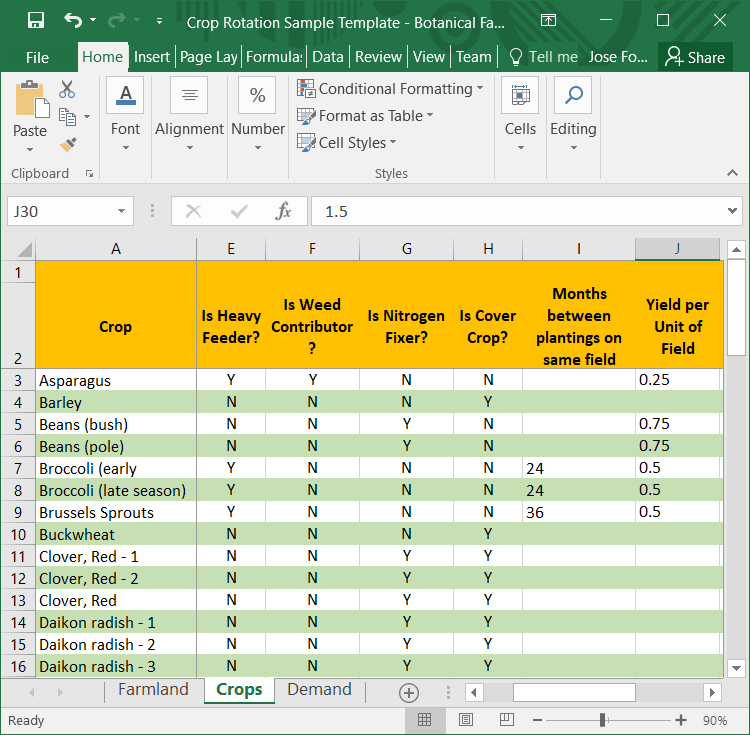

```{r setup, include=FALSE}
knitr::opts_chunk$set(echo = TRUE)
```

# Synopsis

The Crop Rotation model attempts to allocate crops to fields such that the consumption needs of the
user are satisfied while adhering to a set of constraints, described below.


## Elements of the model

There are some basic components of the model that are required for the model to exist. These are:

* A **Farm**, which is a collection of Fields
* **Fields** in the farm. A field is defined, in this model,
as the unit of land that will be planted, as a whole, with a single
crop. Thus it is the minimal, indivisible, planting unit.
The fields can be used in the determination of the rotation or can be set aside. 
The fields have a _measure_ to determine how we calculate yield and produce amount, 
which is under user control and there is an amount of that _measure_ in 
each field. In a vegetable crop setting, the measure will likely be _length_ of row 
(feet or meters of beds or rows, depending on setup); in a farm crop setting, the measure 
will likely be _surface_ of each field (acres or hectares in each field).
* **Demand** is defined as the amount of each product that the user wants to produce in one year.
* The most complex component of the model are the **Crops** which are to be planted in **Fields** to meet the **Demand** for products. In the rotation model one of the more important characteristics of **Crops** is the month(s) in which they can be planted in the **Field** for the specific plant zone in which the **Farm** is located as well as the duration the **Crops** occupy the **Field** before releasing it potentially for the next **Crops**.


## Importing Farm Data

The model accepts its data from an Excel spreadsheet with tab names that identify the elements of the model 
and tab columns that identify the attributes of the element. Both tab names and column structure must adhere
to the standard format that follows. Three tabs are required in the model:

* Farmland
* Demand
* Crops

The spreadsheet must have at least three tabs named with the labels listed; without them the data import will fail.

### Farmland

The **Farmland** tab identifies the **Fields** in the **Farm** by name, their _Measure_ and how much land is _Available_, and whether or not they should be _Included_ in the rotation (acceptable values are Y or N).
The contents of the **Farmland** tab looks like this:


```{r fig.align = 'center', echo=FALSE}
library(knitr)
knitr::include_graphics('images/Farmland Tab.png')
```

### Demand

The **Demand** tab identifies the Crop using a measure called **Is Same Crop As** (described under the Crop tab)
and the amount of the crop required for a year or **Yearly Demand**. The unit of measure of the **Yearly Demand**
is determined by the user and it requires consistency with the measure of yield in the Crop and by reference to the
**Field** unit of measure; i.e., if the crop yields are expressed in pounds per foot of row then the demand should be expressed in pounds per year and the fields should be measured in row feet. 
The contents of the **Demand** Tab looks like follows:

```{r fig.align = 'center', echo=FALSE}
library(knitr)
knitr::include_graphics('images/Demand Tab.png')
```


### Crops

The **Crops** tab identifies the crops the user considers planting and a large collection of attributes about those crops. It also indicates whether a crop is to be planted or not in column **Plant?**. 
The contents of the **Crops** tab that follows shows the columns of the spreadsheet in three images for clarity.

```{r fig.align = 'center', echo=FALSE}
library(knitr)

```

The tab above collects the name of the **Crop**, its botanical **Family**, whether the crop **Is Annual or Perennial?**, although the model currently excludes perennial crops from the rotation and whether the crop contributes to meet the user demand as other crops, column **Is Same Crop As**. In the image you can see how both bush beans and pole beans produce the same product: bean.


```{r fig.align = 'center', echo=FALSE}
library(knitr)

```

The tab above repeats the  **Crop**, as well as adding some attributes of the crop itself (**Is Heavy Feeder?, Is Weed Contributor?, Is Cover Crop?**, which the model will attempt to plant to keep the soil from laying bare) and constraints that the user wants to impose on the crop (**Years between plantings on the same field**). Finally, column J identifies **Yield per Unit of Field**, which represents the amount of product that the field will produce of the crop in the same units of measure as in the **Demand** tab and the **Farmland** tab.


```{r fig.align = 'center', echo=FALSE}
library(knitr)
knitr::include_graphics('images/Crops Tab Right.png')
```

The tab above repeats the  **Crop**, as well as adding attributes related to the planting season of the crop in your plant zone (columns K through V), in this example Zone 7.The **Days to Maturity** identifies how long the specific crop the user has selected will stay in the ground before harvest, thus releasing the field for the next crop. The last column, **Plant?** identifies whether the crop is to be included in the rotation or excluded from it.

\newpage

# The Model

The model we use to generate a crop rotation is a mixed integer linear programming model of the general form:

$$
\begin{aligned}
\text  {Min} &\sum d X + e Y + fZ\\ 
\text {s.t.} &\sum A X + \sum B Y + \sum C Z= 0 \\ 
             &X \in R \\
             &X \ge 0\\ 
             &Y \in \{0,1\}\\
             &Z \in I
\end{aligned}
$$
In this type of model we optimize (maximize or minimize) a linear function subject to a set of constraints over a collection of variables, some of which are continuous and some of which are discrete, either integer or binary.

## Objective Function

In general terms, we try to minimize the unmet demand, i.e., we want to produce as much of each crop as needed and, if it isn't possible to produce all that is needed, then we minimize the gap. In addition, we want to always have something planted in the field, so we will encourage the use of cover crops or crops in general at any point in time.

## Variables

The variables that interest us the most have to do with the crops planted and the demand we have not met. In addition, we will use other variables to interconnect all the elements of the model.

Because the model's time is set to months, and the indivisible unit of land is the field, the key crop variables are represented by $Y_{cfym}$, which indicate whether a crop (c) is planted in a field (f) on a certain year (y) and month (m). The variable will be 1 if the field is planted to the crop and 0 otherwise.

The unmet demand will be represented by the variables that identify the product whose demand is not met in a certain year: $X_{py}$. This unmet demand can be any non-negative value, $X\ge0$, that identifies the product (p) and the year(y) in which the demand was not met.


## Constraints

There are a number of types of constraints that we will implement to manage the rotation. Fundamental to the rotation is the transfer of land (fields) used by a crop or unused from period to period.The set of constraints that define land transfers are the most complex in this model and will be addressed first.

### Constraints that manage land transfers/availability over time periods

Succinctly, every field in the farm can be either planted or not planted in every month of every year; if it is planted, it will become available again once the crop is harvested and, if it is not planted, the field will be available for planting next month. Thus, we will have constraints $C_{fym}$ for each field in each month and year to represent the balance of land in the field: the sum of Field f freed in year y month m + Field f not planted in year y month m-1 must equal the Field f not planted in year y month m + the sum of field f planted in crop c in year y and month m. In mathematical terms:

$$
\begin{aligned}
\text C_{fym} : \quad & - \sum_f F - \sum_{y(m-1)} N + \sum_{ym} N + \sum_{c} P = 0 \qquad\forall fym\\ 
             &F: Freed \\ 
             &N: Not \ Planted\\
             &P: Planted
\end{aligned}
$$

### Constraints that manage unmet demand for the year

Every field planted will eventually produce a crop that meets the demand for one of the **Is Same Crop As** crops. These constraints summarize the production balance of those crops by all fields for every year: the crop **Yield per Unit of Field** of all fields that produce a similar crop during the year y plus the **Unmet Demand** for the year must be greater than the **Demand** for the product loaded from the data spreadsheet. In mathematical terms:

$$
\begin{aligned}
\text C_{cy} : \quad & \sum_c yC + \sum_{s} U \geq d_{c} \qquad\forall cy\\
                     &y: Yields \ of \ planted \ "same \ as" crops \\
                     &U: Unmet \ Demand \ of \ "same \ as" crops
\end{aligned}
$$

